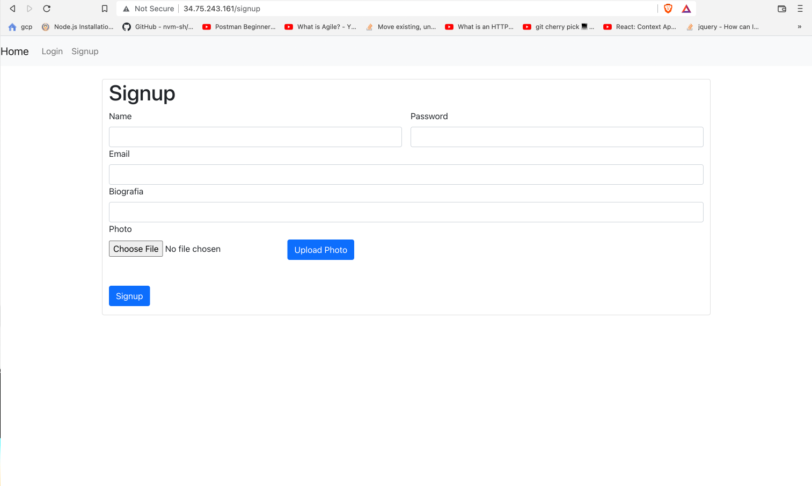
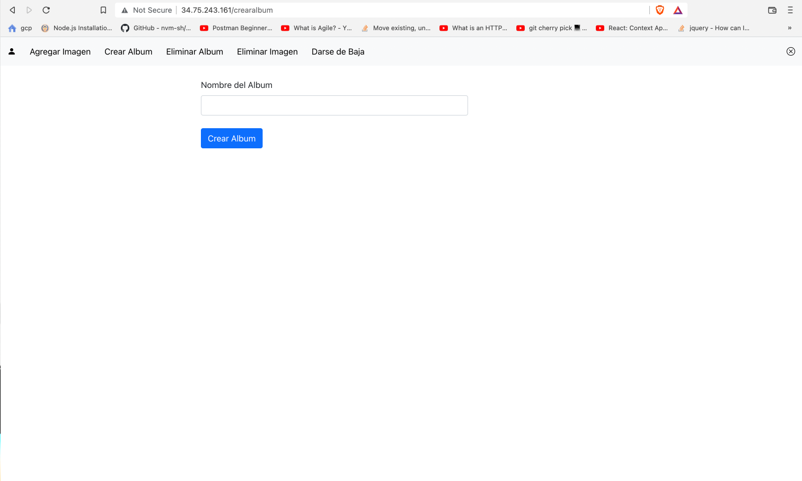

# MyPicz

## Architecture 

## Registro 
Para registrarse en el sistema debe llenar los campos necesarios para darse de alta en la plataformaX.

## Perfil del usuario
En esta seccion se puede ver el perfil del usuario y editar algun valor si se desea. 

## Architecture 
El usuario es capaz de crear album de fotos para almacenar sus fotos favoritas

## Architecture 
En la galeria de fotos se puede seleccionar el album que se quiere ver y se mostraran las fotos que ha sido almacenadas en dicho album

# Comando para crear la instancia de MySQL
gcloud sql instances create mypicz-db \
   --database-version=MYSQL_5_7 --cpu=1 --memory=3.75GB \
   --region=us-central1 --root-password=p2sswrd123Delta

gcloud sql instances create mypicz-db \
--database-version=MYSQL_5_7 --tier=db-g1-small \
--region=us-central1 --root-password=p2sswrd123Delta

# Comando para crear un usuario
gcloud sql users create carlosdavid --host=% \
   --instance=mypicz-db --password=foxtrot321S3cr3t

# Comando para ver info de la instacia
gcloud sql instances describe mypicz

# Comando preparacion de la funcion
mkdir cloudfunction
cd function
touch index.js
npm init
npm install escape-html
npm install @google-cloud/functions-framework
npm install mysql
npm install dotenv

# Comando para realizar el despligue de la cloud function
gcloud functions deploy userHttp --runtime nodejs16 --trigger-http --allow-unauthenticated --security-level=secure-optional --set-env-vars MYSQL_HOST=,MYSQL_USER=,MYSQL_PASSWORD=,MYSQL_DATABASE=

gcloud functions deploy albumsAndPhotosHttp --runtime nodejs16 --trigger-http --allow-unauthenticated --security-level=secure-optional --set-env-vars MYSQL_HOST=,MYSQL_USER=,MYSQL_PASSWORD=,MYSQL_DATABASE=

gcloud functions deploy password --runtime nodejs16 --trigger-http --allow-unauthenticated --security-level=secure-optional --set-env-vars MYSQL_HOST=,MYSQL_USER=,MYSQL_PASSWORD=,MYSQL_DATABASE=

gcloud functions deploy update --runtime nodejs16 --trigger-http --allow-unauthenticated --security-level=secure-optional --set-env-vars MYSQL_HOST=,MYSQL_USER=,MYSQL_PASSWORD=,MYSQL_DATABASE=

gcloud functions add-iam-policy-binding userHttp \
 --member="allUsers" \
 --role="roles/cloudfunctions.invoker"
# Comando para crear el bucket 
gsutil mb gs://mypicz-storage

# Subir files al bucket
npm install @google-cloud/storage
# APP engine deploy
git clone https://github.com/racarlosdavidtelus/mypicz
cd profile-frontend
npm i
npm run build
gcloud app deploy

git pull 
npm run build
gcloud app deploy

# Crear Cluster
    Crear -> Acceso a la linea de comandos
    gcloud container clusters get-credentials <cluster> --zone <zona> --project <proyecto>
# Crear deployment a base del yml
    kubectl apply backend/kubernets/deployment.yml
# Crear VM's
    gcloud compute instances create vmfrontgcp1 \
    --image-family ubuntu-pro-1804-lts \
    --image-project ubuntu-os-pro-cloud \
    --tags rauqozgcp \
    --metadata startup-script="#! /bin/bash
        sudo apt update -y; 
        sudo apt install docker.io -y; 
        sudo chmod 666 /var/run/docker.sock;

        docker run -d -p 80:3000 --name pfrontgcp <imagen de docker>
    "
    gcloud compute instances create vmfrontgcp2 \
    --image-family ubuntu-pro-1804-lts \
    --image-project ubuntu-os-pro-cloud \
    --tags rauqozgcp \
    --metadata startup-script="#! /bin/bash
        sudo apt update -y; 
        sudo apt install docker.io -y; 
        sudo chmod 666 /var/run/docker.sock;

        docker run -d -p 80:3000 --name pfrontgcp <imagen de docker>
    "

    gcloud compute instances create vmfrontgcp3 \
    --image-family ubuntu-pro-1804-lts \
    --image-project ubuntu-os-pro-cloud \
    --tags rauqozgcp \
    --metadata startup-script="#! /bin/bash
        sudo apt update -y; 
        sudo apt install docker.io -y; 
        sudo chmod 666 /var/run/docker.sock;

        docker run -d -p 80:3000 --name pfrontgcp <imagen de docker>
    "
# Crear regla de firewall
    gcloud compute firewall-rules create rauqozfw \
    --target-tags rauqozgcp \
    --allow tcp:80
# Crear LoadBalancer
    gcloud compute addresses create rauqozlb
# Agregando un health-check
    gcloud compute http-health-checks create rauqozhc
# Creacion de un target pool con el health check
    gcloud compute target-pools create rauqoztp \
    --http-health-check rauqozhc
# Agregar las instancias al target pool
    gcloud compute target-pools add-instances rauqoztp \
    --instances vmfrontgcp1,vmfrontgcp2,vmfrontgcp3
# Agregando una regla de entrada
    gcloud compute forwarding-rules create rauqozre \
    --ports 80 \
    --address rauqozlb \
    --target-pool rauqoztp

# Raul
## Compute Engine
    Front App:
        login y signup
        dar de baja
        crear albums
        eliminar albums
        agregar imagenes al album
        eliminar imagen del album
## Kubernets
    Backend: 
        1. login
        2. signup
        3. dar de baja
        4. crear albums
        5. eliminar albums
        6. agregar imagenes al album
        7. eliminar imagen del album
        8. modificar datos
        9. cambiar password

# Carlos
## App Engine
    Front de Perfil:
        ver informacion del perfil
        modificar datos
        cambiar password

## Cloud SQL
    Cloud Sql:
        Crear la base

## Cloud Functions
    Cloud Functions:
        1. Informacion del usuario dependiendo del id: { id_usuario: 0 }
        2. Albums del usuario dependiendo del id: { id_usuario: 0 }
        3. Fotos del usuario dependiendo del id: { id_album: 0 }

# LocalStorage
    id del usuario: 'idUser'

# REFERENCIAS
https://cloud.google.com/sql/docs/mysql/create-instance?hl=es-419#gcloud

https://cloud.google.com/storage/docs/uploading-objects#storage-upload-object-nodejs

https://cloud.google.com/docs/authentication/getting-started#linux-or-macos